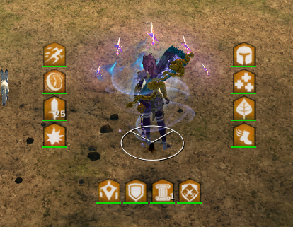
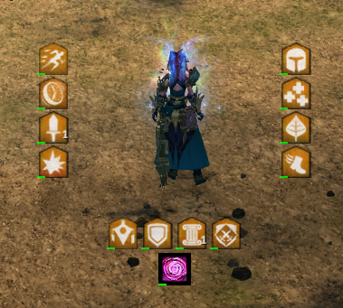
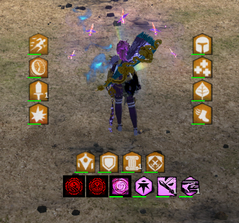
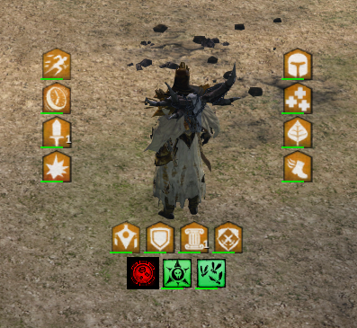

# Zlick's Reffect Pack
A [Reffect](https://github.com/Zerthox/gw2-reffect) pack.

Place the .json file inside the `<Guild Wars 2>\addons\reffect\packs` directory.

## General
Signets that you have to use are displayed in red if they no longer are no longer on cooldown.

## Default
Always
* Offensive boons on the left side
* Defensive boons on the right side
* Situational boons on the bottom

## Mesmer
Always
* Distortion and Blur

### Virtuoso
In Combat
* Traits (Deadly Blades, Fencer's Finesse, Compounding Power)
* Signets (Signet of the Ether, Signet of Illusions)

## Necromancer
### Scourge
In Combat
* Traits (Soul Barbs, Plague Sending)
* Signets (Signet of Spite)

